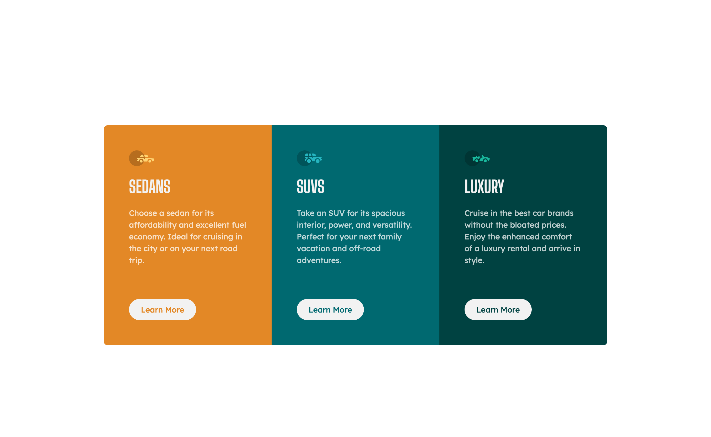

# Frontend Mentor - 3-column preview card component solution

This is a solution to the [3-column preview card component challenge on Frontend Mentor](https://www.frontendmentor.io/challenges/3column-preview-card-component-pH92eAR2-). Frontend Mentor challenges help you improve your coding skills by building realistic projects. 

## Table of contents

- [Overview](#overview)
  - [The challenge](#the-challenge)
  - [Screenshot](#screenshot)
  - [Links](#links)
- [My process](#my-process)
  - [Built with](#built-with)
  - [Continued development](#continued-development)
- [Author](#author)

## Overview

### The challenge

Users should be able to:

- View the optimal layout for the section depending on their device's screen size

### Screenshot

### Links

- [Solution](https://github.com/ryanthayes/fem-3-column-preview-card-component)
- [Live URL](https://ryanthayes.github.io/fem-3-column-preview-card-component)

## My process

### Built with

- Semantic HTML5 markup
- CSS custom properties
- Flexbox
- Mobile-first workflow

### Continued development

I am still not as confident with grid compared to flex. I tried to create this whole project as one big grid with two rows. But I struggled for over an hour trying to get the "cards" to move to different grid columns on the second row. 

I tried grid areas. I tried grid-column-rows. All three "cards" just stayed in the first column of the second row. I could move the two divs on the top row, but no success on the bottom row. So, I ended up using a separate grid for the bottom row.

## Author

- Github - [@ryanthayes](https://github.com/ryanthayes)
- Frontend Mentor - [@ryanthayes](https://www.frontendmentor.io/profile/ryanthayes)
